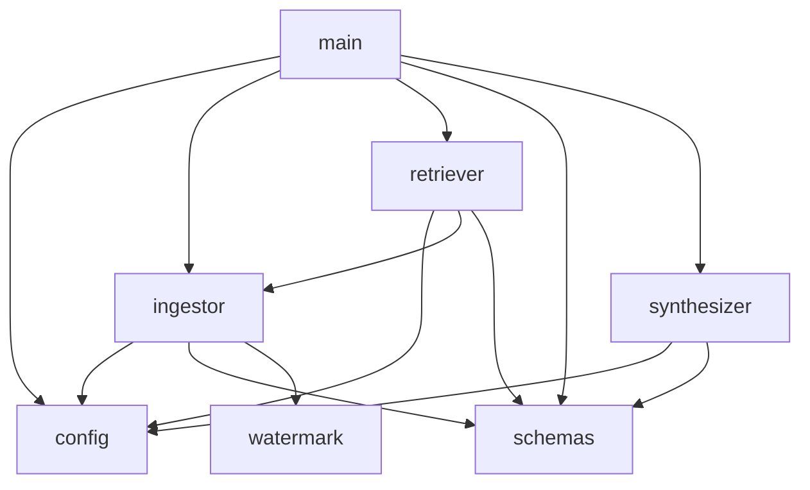

# Project Context

> **Auto-generated by [code-mapper](https://github.com/your-org/code-mapper).**  
> Read this file instead of scanning source files — it captures the full structure at a fraction of the token cost.
> `rag_service` · 9 files (python×9) · 12 classes · 16 functions · ~1,162 source lines

---
## File Structure

```
rag_service/
├── app/
  └── __init__.py
  └── config.py
  └── ingestor.py
  └── main.py
  ├── models/
    └── __init__.py
    └── schemas.py
  └── retriever.py
  └── synthesizer.py
  └── watermark.py
```

## Class Diagram

```mermaid
classDiagram
    class AskRequest["AskRequest"] {
        +query: str
        +ticker: Optional
        +date_from: Optional
        +date_to: Optional
    }
    class AskResponse["AskResponse"] {
        +query: str
        +answer: str
        +sources: List
        +model_used: str
    }
    class ContextResponse["ContextResponse"] {
        +ticker: str
        +chunks: List
        +summary: Optional
    }
    class HealthResponse["HealthResponse"] {
        +status: str
        +chroma_ok: bool
        +embedding_ok: bool
        +llm_ok: bool
    }
    class IngestRequest["IngestRequest"] {
        +sources: List
        +incremental: bool
    }
    class IngestResponse["IngestResponse"] {
        +status: str
        +results: List
        +total_docs_added: int
        +duration_seconds: float
    }
    class IngestResult["IngestResult"] {
        +source: str
        +docs_added: int
        +docs_skipped: int
        +watermark_advanced_to: Optional
    }
    class Settings["Settings"] {
        +host: str
        +port: int
        +chroma_persist_dir: str
        +chroma_collection: str
    }
    class SourceChunk["SourceChunk"] {
        +doc_id: str
        +text: str
        +source: str
        +ticker: Optional
    }
    class SummarizeRequest["SummarizeRequest"] {
        +run_report: Dict
    }
    class SummarizeResponse["SummarizeResponse"] {
        +narrative: str
        +sources: List
        +model_used: str
    }
    class WatermarkStore["WatermarkStore"] {
        +get()
        +get_global()
        +set()
        +set_global()
        +now_iso()
        +__init__()
    }
```



## Module Dependencies



## Symbol Index


**`app\config.py`** `python`
> RAG service configuration — all values overridable via environment variables.
- `class Settings(BaseSettings)`
- `def get_settings() → Settings`

**`app\ingestor.py`** `python`
> RAG ingestion layer — verbalizes data from all 4 Tier-1 sources into ChromaDB.
- `def get_collection(settings: Optional) → Any`
- `def ingest_sentiment(collection: Any, watermark: WatermarkStore, settings: Settings) → IngestResult`
- `def ingest_risk(collection: Any, watermark: WatermarkStore, settings: Settings) → IngestResult`
- `def ingest_trades(collection: Any, watermark: WatermarkStore, settings: Settings) → IngestResult`
- `def ingest_market_data(collection: Any, watermark: WatermarkStore, settings: Settings) → IngestResult`
- `def ingest_articles(collection: Any, watermark: WatermarkStore, settings: Settings) → IngestResult`  — Tier 2: ingest per-article sentiment data from article_sentiments table.
- `def run_ingestion(sources: List, settings: Optional) → List`

**`app\main.py`** `python`
> RAG Market Intelligence Service — FastAPI app on port 8200.
- `def health() → HealthResponse`
- `def ingest(req: IngestRequest) → IngestResponse`
- `def ask(req: AskRequest) → AskResponse`
- `def summarize(req: SummarizeRequest) → SummarizeResponse`
- `def context(ticker: str, days: int) → ContextResponse`

**`app\models\schemas.py`** `python`
> Pydantic schemas for the RAG service API.
- `class IngestRequest(BaseModel)`
- `class IngestResult(BaseModel)`
- `class IngestResponse(BaseModel)`
- `class AskRequest(BaseModel)`
- `class SourceChunk(BaseModel)`
- `class AskResponse(BaseModel)`
- `class SummarizeRequest(BaseModel)`
- `class SummarizeResponse(BaseModel)`
- `class ContextResponse(BaseModel)`
- `class HealthResponse(BaseModel)`

**`app\retriever.py`** `python`
> ChromaDB retrieval pipeline with multi-query expansion and metadata filtering.
- `def retrieve(query: str, ticker: Optional, date_from: Optional, date_to: Optional) → List`  — Multi-query ChromaDB retrieval with deduplication.

**`app\synthesizer.py`** `python`
> LLM synthesis — builds prompts from retrieved chunks and calls the configured LLM.
- `def synthesize_answer(query: str, chunks: List, settings: Optional, system_prompt: Optional) → tuple`  — Call LLM with retrieved context. Returns (answer, model_used).
- `def synthesize_run_summary(run_report: dict, chunks: List, settings: Optional) → tuple`  — Build run summary prompt from report dict + retrieved context.

**`app\watermark.py`** `python`
> Watermark tracking for incremental RAG ingestion.
- `class WatermarkStore`  — Persistent JSON watermark file: {source: {ticker: last_ingested_iso}}.
  methods: `get`, `get_global`, `set`, `set_global`, `now_iso`